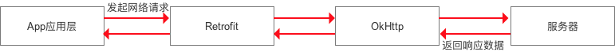

# 学习retrofit的使用过程

## Retrofit的简介


准确的来说，Retrofit是一个RESTful的HTTP网络请求框架的封装，实际网络请求工作的本质是由OkHttp完成，Retrofit仅负责网络请求接口的封装（Retofit接口层封装请求参数、Header、URL等）


在服务器返回响应数据的时候，OkHttp将原始的结果返回给Retrofit，Retrofit会根据用户的需求对返回数据进行解析

## Retrofit 使用步骤

step1:添加Retrofit库的依赖

step2：创建接收服务器返回数据的类

step3：创建用于描述网络请求的接口

step4：创建Retrofit实例

```kotlin
Retrofit retrofit = new Retrofit.Builder()
                    .baseUrl(url)
                    .addConverterFactory(GsonConverterFactory.create())//设置数据解析器
                    .addCallAdapterFactory(RxJavaCallAdapterFactory.create())//支持RxJava平台
                    .build();
```

step5：创建网络请求接口实例并配置网络请求参数

step6:发送网络请求（同步/异步）

step7：处理服务器返回的数据